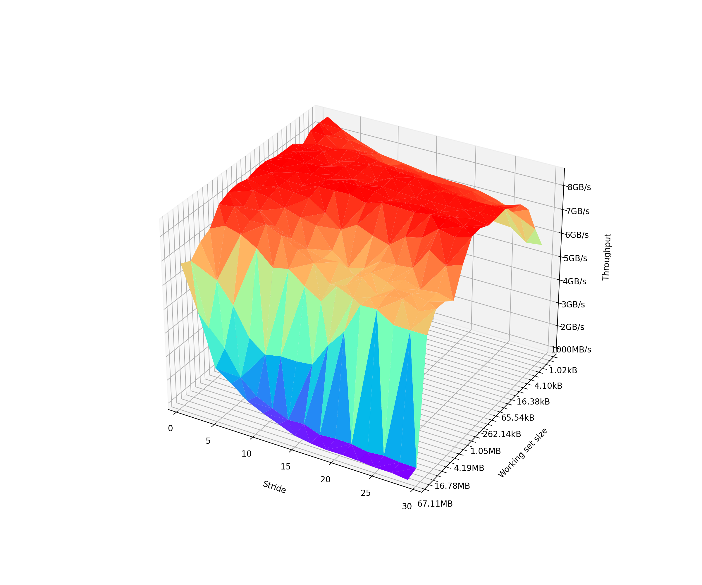

# The memory mountain

**This fork patches the original work in python3**

This program is intended to help reproduce the "memory mountain" plot
which illustrates the cover of the book "Computer Systems: A
Programmer's Perspective" by Randal E. Bryant and David R. O'Hallaron.

http://csapp.cs.cmu.edu/

(search google for a .pdf version of the book)

# Basic idea

We're measuring the memory bandwidth of various levels of the memory
hierarchy, and the impact of the (spatial and temporal) locality of
accesses. For that, the program allocates a flat data buffer, walks
through it, then computes the actual read throughput.

This is explained in detail in section 6.6.1 of the book, so go read it.

# Usage

**just type `make plot` and enjoy the show.**

dependencies:

- gcc
- python3
- matplotlib/numpy

# Implementation

The program `benchmark.c` runs the actual function from the book and
measures its execution time:

    data_t test()
    {
        data_t result=0;
        size_t i;
        for( i=0; i<count; i += stride )
        {
            result += data[i];
        }
        return result;
    }

Notes:

- we actually have to do something with the values (i.e. accumulate
  the sum in the `result` variable) otherwise the compiler and the CPU
  do voodoo optimizations and skew the results. (hence the `volatile`
  variable in the main program)

- the program allows for changing the `data_t` type to various sizes
  (`char`, `short`, `int`, `double`) but in my experience, only
  `double` (native register size ?) gives interesting results. but YMMV

- for small data sizes, the execution time is too small to be
  significant (we measure time with `clock()`, which has a resolution
  of microseconds). So we repeat the call and measure the execution
  time of
  10 calls, then 100 calls, and so on, until we get a significant
  measurement (above 1ms). But this is bad, because the processor is able
  to detect the nested loop and accelerate it massively. A better
  approach would be to use hardware counters to get nanosecond
  accuracy, but then the program is not portable any more. (the original
  program, by the book authors does that. It's interesting to compare the
  two)

## Interpreting the output

The program first reports how it parsed its command-line parameters.
Then it calls `test()` enough times to measure a significant execution time.
Once a satisfying measure is obtain, we compute the time required for one `test()`
Last, we print out a summary of the experiments: how much we did read,
in how much time, and the corresponding throughput.

    $ ./benchmark 3000 3
    size=3000 (3kB ; 375 items of size 8) stride=3
    1 repeats -> 0us
    10 repeats -> 0us
    100 repeats -> 0us
    1000 repeats -> 0us
    10000 repeats -> 0us
    100000 repeats -> 10ms
    1000000 repeats -> 140ms
    => one repeat -> 0.14us
    read 1kB in 0.14us = 7142.9 MB/s

# Running an experiment

The script `harness.py` invokes the `benchmark` program with various
SIZE and STRIDE parameters.

To reduce measurement noise, we run the program multiple times, and
only keep the median value.

You should redirect the output of `harness.py` in a file so that you
can plot them later:

    $ ./harness.py > results.txt

## Interpreting the output

For each series of runs the script prints a line with the
SIZE and STRIDE parameters, followed by the median throughput (in
MBytes/s)

example:

    2048 1 6826.7
    2048 5 8500.0
    2048 9 8960.0
    2048 13 8941.2
    2048 17 8571.4

# Plotting the results

The script `plot.py` loads data from a text file and builds an
interactive 3D plot using `matplotlib`.

    $ ./plot.py results.txt

You can turn around the mountain with your mouse.

Notes:

- `matplotlib` doesn't support logarithmic 3D plots, so we have to
  jump through hoops to get figure looking a similar to that of the
  book.
- the color scheme is "rainbow": it goes from purple (lowest
  bandwidth) to red (highest bandwidth) **regardless** of the actual
  numbers, so pay attention to the vertical scale when looking at
  plots from different machines.

# My Memory Mountain

The properties of my machine is as follows.

> Model Name: Mac mini
>
> Model Identifier: Macmini8,1
>
> Processor Name: 6-Core Intel Core i7
>
> Processor Speed: 3.2 GHz
>
> Number of Processors: 1
>
> Total Number of Cores: 6
>
> L2 Cache (per Core): 256 KB
>
> L3 Cache: 12 MB
>
> Hyper-Threading Technology: Enabled
>
> Memory: 32 GB

My memory mountain is as follows

